# Workflows

- **Broadcast Release**
- **Build**
- **New Release - GitHub**
- **New Release - Update other projects**
- **Update Dependencies**
- **Release API**
- **New Release - Slack**
- **Server Shutdown Tests**
- **Publish Artifacts**
- **Security - Dependency Analysis (dependabot)**

## Table of Contents

- [Workflow Triggers - Flowchart](#workflow-triggers---flowchart)
- [Broadcast Release](#broadcast-release)
- [Build](#build)
- [New Release - GitHub](#new-release---github)
- [New Release - Update other projects](#new-release---update-other-projects)
- [Update Dependencies](#update-dependencies)
- [Release API](#release-api)
- [New Release - Slack](#new-release---slack)
- [Server Shutdown Tests](#server-shutdown-tests)
- [Publish Artifacts](#publish-artifacts)
- [Security - Dependency Analysis (dependabot)](#security---dependency-analysis-dependabot)

## Workflow Triggers - Flowchart

```mermaid
flowchart LR
    schedule(["⏰ schedule"])
    workflowdispatch(["👤 workflow_dispatch"])
    push(["📤 push"])
    pullrequest(["🔀 pull_request"])
    repositorydispatch(["🔔 repository_dispatch"])
    broadcastrelease["Broadcast Release"]
    build["Build"]
    newreleasegithub["New Release - GitHub"]
    newreleaseupdateotherprojects["New Release - Update other projects"]
    updatedependencies["Update Dependencies"]
    releaseapi["Release API"]
    newreleaseslack["New Release - Slack"]
    servershutdowntests["Server Shutdown Tests"]
    publishartifacts["Publish Artifacts"]
    securitydependencyanalysisdependabot["Security - Dependency Analysis (dependabot)"]
    schedule -->|"0 * * * *"|broadcastrelease
    schedule -->|"0 7 * * 1"|updatedependencies
    schedule -->|"0 12 * * 3"|securitydependencyanalysisdependabot
    workflowdispatch --> broadcastrelease
    workflowdispatch --> updatedependencies
    push -->|"branches(only: 1), paths(ignore: 1)"|build
    push -->|"branches(only: 1), paths(ignore: 1)"|servershutdowntests
    push -->|"tags(only: 1)"|publishartifacts
    push -->|"branches(only: 1), paths(ignore: 1)"|securitydependencyanalysisdependabot
    pullrequest -->|"(*), branches"|build
    repositorydispatch -->|"http4k-release"|newreleasegithub
    repositorydispatch -->|"http4k-release"|newreleaseupdateotherprojects
    repositorydispatch -->|"http4k-release"|releaseapi
    repositorydispatch -->|"http4k-release"|newreleaseslack
    broadcastrelease --> repositorydispatch
    newreleaseupdateotherprojects --> repositorydispatch
```

## Broadcast Release

```mermaid
%%{init: {"flowchart": {"curve": "basis"}}}%%
flowchart TD
    schedule(["⏰ schedule<br/>0 * * * *"])
    workflowdispatch(["👤 workflow_dispatch"])
    subgraph broadcastrelease["Broadcast Release"]
        broadcastrelease_checknewversion["check-new-version<br/>🐧 ubuntu-latest<br/>🔐 if: github.repository == 'http4k\/http4k'<br/>📤 Outputs: requires-broadcast, version"]
        broadcastrelease_broadcastrelease["broadcast-release<br/>🐧 ubuntu-latest<br/>🔐 if: needs.check-new-version.outputs.requires-broadcast == 'true'"]
        broadcastrelease_checknewversion --> broadcastrelease_broadcastrelease
    end
    schedule --> broadcastrelease_checknewversion
    workflowdispatch --> broadcastrelease_checknewversion
```

## Build

```mermaid
%%{init: {"flowchart": {"curve": "basis"}}}%%
flowchart TD
    push(["📤 push<br/>branches(only: 1), paths(ignore: 1)"])
    pullrequest(["🔀 pull_request<br/>(*), branches"])
    subgraph build["Build"]
        build_build["build<br/>🐧 ubuntu-latest<br/>🔑 Uses secrets"]
    end
    push --> build_build
    pullrequest --> build_build
```

## New Release - GitHub

## New Release - Update other projects

```mermaid
%%{init: {"flowchart": {"curve": "basis"}}}%%
flowchart TD
    repositorydispatch(["🔔 repository_dispatch<br/>(http4k-release)"])
    subgraph newreleaseupdateotherprojects["New Release - Update other projects"]
        newreleaseupdateotherprojects_createupgradebranches["create-upgrade-branches<br/>🐧 ubuntu-latest<br/>📊 Matrix: repo (10 runs)"]
    end
    repositorydispatch --> newreleaseupdateotherprojects_createupgradebranches
```

## Update Dependencies

```mermaid
%%{init: {"flowchart": {"curve": "basis"}}}%%
flowchart TD
    workflowdispatch(["👤 workflow_dispatch"])
    schedule(["⏰ schedule<br/>0 7 * * 1"])
    subgraph updatedependencies["Update Dependencies"]
        updatedependencies_updatedependencies["Update Version Catalog<br/>🐧 ubuntu-latest"]
    end
    workflowdispatch --> updatedependencies_updatedependencies
    schedule --> updatedependencies_updatedependencies
```

## Release API

```mermaid
%%{init: {"flowchart": {"curve": "basis"}}}%%
flowchart TD
    repositorydispatch(["🔔 repository_dispatch<br/>(http4k-release)"])
    subgraph releaseapi["Release API"]
        releaseapi_releaseapi["release-api<br/>🐧 ubuntu-latest"]
    end
    repositorydispatch --> releaseapi_releaseapi
```

## New Release - Slack

```mermaid
%%{init: {"flowchart": {"curve": "basis"}}}%%
flowchart TD
    repositorydispatch(["🔔 repository_dispatch<br/>(http4k-release)"])
    subgraph newreleaseslack["New Release - Slack"]
        newreleaseslack_metadata[["🔧 Workflow Config<br/>🔐 custom permissions"]]
        newreleaseslack_slackify["slackify<br/>🐧 ubuntu-latest"]
    end
    repositorydispatch --> newreleaseslack_slackify
```

## Server Shutdown Tests

```mermaid
%%{init: {"flowchart": {"curve": "basis"}}}%%
flowchart TD
    push(["📤 push<br/>branches(only: 1), paths(ignore: 1)"])
    subgraph servershutdowntests["Server Shutdown Tests"]
        servershutdowntests_runtests["Run Shutdown Tests<br/>🐧 ubuntu-latest<br/>🔑 Uses secrets"]
    end
    push --> servershutdowntests_runtests
```

## Publish Artifacts

```mermaid
%%{init: {"flowchart": {"curve": "basis"}}}%%
flowchart TD
    push(["📤 push<br/>tags(only: 1)"])
    subgraph publishartifacts["Publish Artifacts"]
        publishartifacts_metadata[["🔧 Workflow Config<br/>🌍 1 env var"]]
        publishartifacts_release["release<br/>🐧 ubuntu-latest<br/>🔐 if: github.repository == 'http4k\/http4k'"]
    end
    push --> publishartifacts_release
```

## Security - Dependency Analysis (dependabot)

```mermaid
%%{init: {"flowchart": {"curve": "basis"}}}%%
flowchart TD
    push(["📤 push<br/>branches(only: 1), paths(ignore: 1)"])
    schedule(["⏰ schedule<br/>0 12 * * 3"])
    subgraph securitydependencyanalysisdependabot["Security - Dependency Analysis (dependabot)"]
        securitydependencyanalysisdependabot_build["Dependencies<br/>🐧 ubuntu-latest<br/>🔐 if: github.repository == 'http4k\/http4k'"]
    end
    push --> securitydependencyanalysisdependabot_build
    schedule --> securitydependencyanalysisdependabot_build
```

