# Workflows

- **Build**
- **New Release - GitHub**
- **New Release - Update other projects**
- **Update Dependencies**
- **Release API**
- **New Release - Slack**
- **Server Shutdown Tests**
- **Publish Artifacts**
- **Security - Dependency Analysis (dependabot)**

## Table of Contents

- [Workflow Triggers - Flowchart](#workflow-triggers---flowchart)
- [Build](#build)
- [New Release - GitHub](#new-release---github)
- [New Release - Update other projects](#new-release---update-other-projects)
- [Update Dependencies](#update-dependencies)
- [Release API](#release-api)
- [New Release - Slack](#new-release---slack)
- [Server Shutdown Tests](#server-shutdown-tests)
- [Publish Artifacts](#publish-artifacts)
- [Security - Dependency Analysis (dependabot)](#security---dependency-analysis-dependabot)

## Workflow Triggers - Flowchart

```mermaid
flowchart LR
    push(["📤 push<br/>branches#91;only: 1#93;, paths#91;ignore: 1#93;"])
    pull_request(["🔀 pull_request<br/>#91;*#93;, branches"])
    repository_dispatch_http4k_release(["🔔 repository_dispatch<br/>#91;http4k-release#93;"])
    workflow_dispatch(["👤 workflow_dispatch"])
    schedule(["⏰ schedule<br/>0 7 * * 1"])
    build[Build]
    new_release___github[New Release - GitHub]
    new_release___update_other_projects[New Release - Update other projects]
    update_dependencies[Update Dependencies]
    release_api[Release API]
    new_release___slack[New Release - Slack]
    server_shutdown_tests[Server Shutdown Tests]
    publish_artifacts[Publish Artifacts]
    security___dependency_analysis_(dependabot)[Security - Dependency Analysis (dependabot)]
    push --> build
    push --> server_shutdown_tests
    push --> publish_artifacts
    push --> security___dependency_analysis_(dependabot)
    pull_request --> build
    repository_dispatch_http4k_release --> new_release___github
    repository_dispatch_http4k_release --> new_release___update_other_projects
    repository_dispatch_http4k_release --> release_api
    repository_dispatch_http4k_release --> new_release___slack
    workflow_dispatch --> update_dependencies
    schedule --> update_dependencies
    schedule --> security___dependency_analysis_(dependabot)
```

## Build


## New Release - GitHub

```mermaid
%%{init: {"flowchart": {"curve": "basis"}}}%%
flowchart TD
    repository_dispatch(["🔔 repository_dispatch<br/>#91;http4k-release#93;"])
    subgraph new_release___github["New Release - GitHub"]
        new_release___github_metadata[["🔧 Workflow Config<br/>🔐 custom permissions"]]
        new_release___github_release["release<br/>🐧 ubuntu-latest"]
    end
    repository_dispatch --> new_release___github_release
```



## New Release - Update other projects

```mermaid
%%{init: {"flowchart": {"curve": "basis"}}}%%
flowchart TD
    repository_dispatch(["🔔 repository_dispatch<br/>#91;http4k-release#93;"])
    subgraph new_release___update_other_projects["New Release - Update other projects"]
        new_release___update_other_projects_create_upgrade_branches["create-upgrade-branches<br/>🐧 ubuntu-latest<br/>📊 Matrix: repo #91;10 runs#93;"]
    end
    repository_dispatch --> new_release___update_other_projects_create_upgrade_branches
```



## Update Dependencies


## Release API

```mermaid
%%{init: {"flowchart": {"curve": "basis"}}}%%
flowchart TD
    repository_dispatch(["🔔 repository_dispatch<br/>#91;http4k-release#93;"])
    subgraph release_api["Release API"]
        release_api_release_api["release-api<br/>🐧 ubuntu-latest"]
    end
    repository_dispatch --> release_api_release_api
```



## New Release - Slack


## Server Shutdown Tests

```mermaid
%%{init: {"flowchart": {"curve": "basis"}}}%%
flowchart TD
    push(["📤 push<br/>branches#91;only: 1#93;, paths#91;ignore: 1#93;"])
    subgraph server_shutdown_tests["Server Shutdown Tests"]
        server_shutdown_tests_run_tests["Run Shutdown Tests<br/>🐧 ubuntu-latest<br/>🔑 Uses secrets"]
    end
    push --> server_shutdown_tests_run_tests
```



## Publish Artifacts

```mermaid
%%{init: {"flowchart": {"curve": "basis"}}}%%
flowchart TD
    push(["📤 push"])
    subgraph publish_artifacts["Publish Artifacts"]
        publish_artifacts_metadata[["🔧 Workflow Config<br/>🌍 1 env var"]]
        publish_artifacts_release["release<br/>🐧 ubuntu-latest<br/>🔐 if: github.repository == 'http4k\/http4k'"]
    end
    push --> publish_artifacts_release
```



## Security - Dependency Analysis (dependabot)

```mermaid
%%{init: {"flowchart": {"curve": "basis"}}}%%
flowchart TD
    push(["📤 push<br/>branches#91;only: 1#93;, paths#91;ignore: 1#93;"])
    schedule(["⏰ schedule<br/>0 12 * * 3"])
    subgraph security___dependency_analysis_(dependabot)["Security - Dependency Analysis (dependabot)"]
        security___dependency_analysis_(dependabot)_build["Dependencies<br/>🐧 ubuntu-latest<br/>🔐 if: github.repository == 'http4k\/http4k'"]
    end
    push --> security___dependency_analysis_(dependabot)_build
    schedule --> security___dependency_analysis_(dependabot)_build
```