# Workflows

```mermaid
flowchart LR
    schedule(["⏰ schedule"])
    workflowdispatch(["👤 workflow_dispatch"])
    push(["📤 push"])
    pullrequest(["🔀 pull_request"])
    repositorydispatchgithubrepository(["🔔 repository_dispatch<br/>→ this repo"])
    repositorydispatchmatrixrepo(["🔔 repository_dispatch<br/>→ matrix.repo"])
    broadcastrelease["Broadcast Release"]
    build["Build"]
    newreleasegithub["New Release - GitHub"]
    newreleaseupdateotherprojects["New Release - Update other projects"]
    updatedependencies["Update Dependencies"]
    releaseapi["Release API"]
    newreleaseslack["New Release - Slack"]
    servershutdowntests["Server Shutdown Tests"]
    publishartifacts["Publish Artifacts"]
    securitydependencyanalysisdependabot["Security - Dependency Analysis (dependabot)"]
    schedule -->|"0 * * * *"|broadcastrelease
    schedule -->|"0 7 * * 1"|updatedependencies
    schedule -->|"0 12 * * 3"|securitydependencyanalysisdependabot
    workflowdispatch --> broadcastrelease
    workflowdispatch --> updatedependencies
    push -->|"branches(only: 1), paths(ignore: 1)"|build
    push -->|"branches(only: 1), paths(ignore: 1)"|servershutdowntests
    push -->|"tags(only: 1)"|publishartifacts
    push -->|"branches(only: 1), paths(ignore: 1)"|securitydependencyanalysisdependabot
    pullrequest -->|"(*), branches"|build
    broadcastrelease --> repositorydispatchgithubrepository
    repositorydispatchgithubrepository -->|"http4k-release"|newreleasegithub
    repositorydispatchgithubrepository -->|"http4k-release"|newreleaseupdateotherprojects
    repositorydispatchgithubrepository -->|"http4k-release"|releaseapi
    repositorydispatchgithubrepository -->|"http4k-release"|newreleaseslack
    newreleaseupdateotherprojects --> repositorydispatchmatrixrepo
```

## Workflows

- [Broadcast Release](./broadcast-release/)
- [Build](./build/)
- [New Release - GitHub](./new-release---github/)
- [New Release - Slack](./new-release---slack/)
- [New Release - Update other projects](./new-release---update-other-projects/)
- [Publish Artifacts](./publish-artifacts/)
- [Release API](./release-api/)
- [Security - Dependency Analysis (dependabot)](./security---dependency-analysis-dependabot/)
- [Server Shutdown Tests](./server-shutdown-tests/)
- [Update Dependencies](./update-dependencies/)