# Workflows

```mermaid
flowchart LR
    push(["📤 push"])
    pullrequest(["🔀 pull_request"])
    schedule(["⏰ schedule"])
    workflowdispatch(["👤 workflow_dispatch"])
    repositorydispatchgithubrepository(["🔔 repository_dispatch<br/>→ this repo"])
    repositorydispatchmatrixrepo(["🔔 repository_dispatch<br/>→ ${{ matrix.repo }}"])
    buildhttp4kyml["Build"]
    broadcastreleaseyml["Broadcast Release"]
    newreleasegithubyml["New Release - GitHub"]
    newreleaseupgradebranchesyml["New Release - Update other projects"]
    updatedependenciesyml["Update Dependencies"]
    releaseapiyml["Release API"]
    newreleaseslackyml["New Release - Slack"]
    shutdowntestsyml["Server Shutdown Tests"]
    publishartifactsyml["Publish Artifacts"]
    securitydependabotyml["Security - Dependency Analysis (dependabot)"]
    push -->|"branches(only: 1), paths(ignore: 1)"|buildhttp4kyml
    push -->|"branches(only: 1), paths(ignore: 1)"|shutdowntestsyml
    push -->|"tags(only: 1)"|publishartifactsyml
    push -->|"branches(only: 1), paths(ignore: 1)"|securitydependabotyml
    pullrequest -->|"(*), branches(ignore: 1), paths(ignore: 1)"|buildhttp4kyml
    schedule -->|"0 * * * *"|broadcastreleaseyml
    schedule -->|"0 8 * * 1"|updatedependenciesyml
    schedule -->|"0 12 * * 3"|securitydependabotyml
    workflowdispatch --> broadcastreleaseyml
    workflowdispatch --> updatedependenciesyml
    workflowdispatch -->|"inputs: version"|releaseapiyml
    broadcastreleaseyml --> repositorydispatchgithubrepository
    repositorydispatchgithubrepository -->|"http4k-release"|newreleasegithubyml
    repositorydispatchgithubrepository -->|"http4k-release"|newreleaseupgradebranchesyml
    repositorydispatchgithubrepository -->|"http4k-release"|releaseapiyml
    repositorydispatchgithubrepository -->|"http4k-release"|newreleaseslackyml
    newreleaseupgradebranchesyml --> repositorydispatchmatrixrepo
```

## Workflows

- [Broadcast Release](./broadcast-release/)
- [Build](./build-http4k/)
- [New Release - GitHub](./new-release-github/)
- [New Release - Slack](./new-release-slack/)
- [New Release - Update other projects](./new-release-upgrade-branches/)
- [Publish Artifacts](./publish-artifacts/)
- [Release API](./release-api/)
- [Security - Dependency Analysis (dependabot)](./security-dependabot/)
- [Server Shutdown Tests](./shutdown-tests/)
- [Update Dependencies](./update-dependencies/)