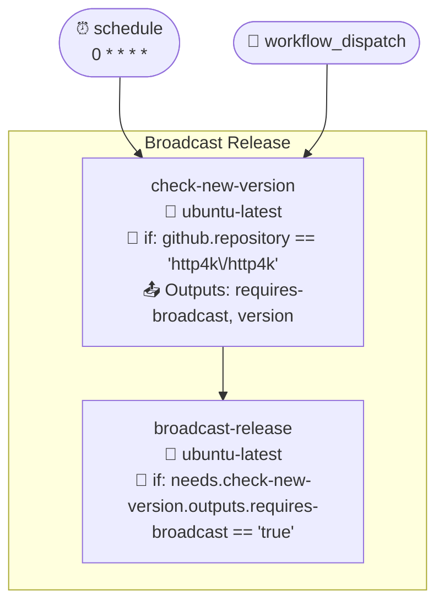
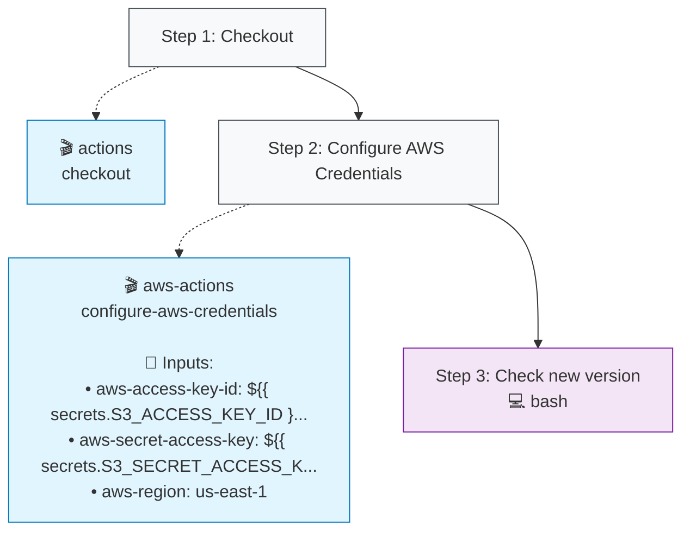
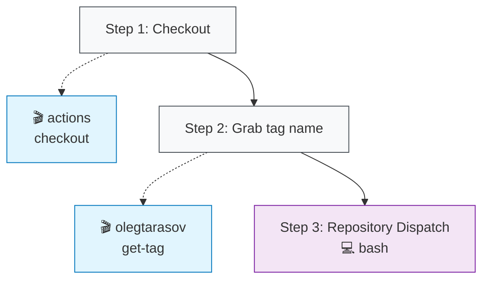

# Broadcast Release (broadcast-release.yml)

## Job: check-new-version

| Job | OS | Dependencies | Config |
|-----|----|--------------|---------| 
| `check-new-version` | 🐧 ubuntu-latest | - | 🔐 if 📤 2 outputs |

### Steps

**Step Types Legend:**
- 🔘 **Step Nodes** (Gray): Workflow step execution
- 🔵 **Action Blocks** (Blue): External GitHub Actions
- 🔷 **Action Blocks** (Light Blue): Local repository actions
- 🟣 **Script Nodes** (Purple): Run commands/scripts
- **Solid arrows** (→): Step execution flow
- **Dotted arrows** (-.->): Action usage with inputs

## Job: broadcast-release

| Job | OS | Dependencies | Config |
|-----|----|--------------|---------| 
| `broadcast-release` | 🐧 ubuntu-latest | `check-new-version` | 🔐 if |

### Steps

**Step Types Legend:**
- 🔘 **Step Nodes** (Gray): Workflow step execution
- 🔵 **Action Blocks** (Blue): External GitHub Actions
- 🔷 **Action Blocks** (Light Blue): Local repository actions
- 🟣 **Script Nodes** (Purple): Run commands/scripts
- **Solid arrows** (→): Step execution flow
- **Dotted arrows** (-.->): Action usage with inputs