# Update Dependencies (refresh-versions.yml)

```mermaid
%%{init: {"flowchart": {"curve": "basis"}}}%%
flowchart TD
    workflowdispatch(["👤 workflow_dispatch"])
    schedule(["⏰ schedule<br/>0 7 * * 1"])
    subgraph refreshversionsyml["Update Dependencies"]
        refreshversionsyml_updatedependencies["Update Version Catalog<br/>🐧 ubuntu-latest"]
    end
    workflowdispatch --> refreshversionsyml_updatedependencies
    schedule --> refreshversionsyml_updatedependencies
```

## Job: Update Version Catalog

| Job | OS | Dependencies | Config |
|-----|----|--------------|---------| 
| `update-dependencies` | 🐧 ubuntu-latest | - | - |

### Steps

```mermaid
%%{init: {"flowchart": {"curve": "basis"}}}%%
flowchart TD
    step1["Step 1: Checkout"]
    style step1 fill:#f8f9fa,stroke:#495057
    action1["🎬 actions<br/>checkout<br/><br/>📝 Inputs:<br/>• ref: master<br/>• token: ${{ secrets.GITHUB_TOKEN }}"]
    style action1 fill:#e1f5fe,stroke:#0277bd
    step1 -.-> action1
    step2["Step 2: Setup Java"]
    style step2 fill:#f8f9fa,stroke:#495057
    action2["🎬 actions<br/>setup-java<br/><br/>📝 Inputs:<br/>• java-version: 21<br/>• distribution: adopt"]
    style action2 fill:#e1f5fe,stroke:#0277bd
    step2 -.-> action2
    step1 --> step2
    step3["Step 3: Setup Gradle"]
    style step3 fill:#f8f9fa,stroke:#495057
    action3["🎬 gradle<br/>actions/setup-gradle"]
    style action3 fill:#e1f5fe,stroke:#0277bd
    step3 -.-> action3
    step2 --> step3
    step4["Step 4: Create dependency update branch<br/>💻 bash"]
    style step4 fill:#f3e5f5,stroke:#7b1fa2
    step3 --> step4
    step5["Step 5: Update version catalog<br/>💻 bash"]
    style step5 fill:#f3e5f5,stroke:#7b1fa2
    step4 --> step5
    step6["Step 6: Check for changes<br/>💻 bash"]
    style step6 fill:#f3e5f5,stroke:#7b1fa2
    step5 --> step6
    step7["Step 7: Build<br/>🔐 if: steps.verify-changed-files.outputs.changed == 'true'<br/>💻 bash<br/>⏱️ 120m timeout"]
    style step7 fill:#f3e5f5,stroke:#7b1fa2
    step6 --> step7
    step8["Step 8: Commit and push changes<br/>🔐 if: steps.verify-changed-files.outputs.changed == 'true'<br/>💻 bash"]
    style step8 fill:#f3e5f5,stroke:#7b1fa2
    step7 --> step8
    step9["Step 9: Create Pull Request<br/>🔐 if: steps.verify-changed-files.outputs.changed == 'true'"]
    style step9 fill:#f8f9fa,stroke:#495057
    action9["🎬 repo-sync<br/>pull-request<br/><br/>📝 Inputs:<br/>• source_branch: dependency-update<br/>• destination_branch: master<br/>• pr_title: = Update dependencies to lates...<br/>• pr_body: ## > Automated Dependency Upda...<br/>• pr_draft: false<br/>• github_token: ${{ secrets.GITHUB_TOKEN }}"]
    style action9 fill:#e1f5fe,stroke:#0277bd
    step9 -.-> action9
    step8 --> step9
    step10["Step 10: No changes<br/>🔐 if: steps.verify-changed-files.outputs.changed == 'false'<br/>💻 bash"]
    style step10 fill:#f3e5f5,stroke:#7b1fa2
    step9 --> step10
```

**Step Types Legend:**
- 🔘 **Step Nodes** (Gray): Workflow step execution
- 🔵 **Action Blocks** (Blue): External GitHub Actions
- 🔷 **Action Blocks** (Light Blue): Local repository actions
- 🟣 **Script Nodes** (Purple): Run commands/scripts
- **Solid arrows** (→): Step execution flow
- **Dotted arrows** (-.->): Action usage with inputs