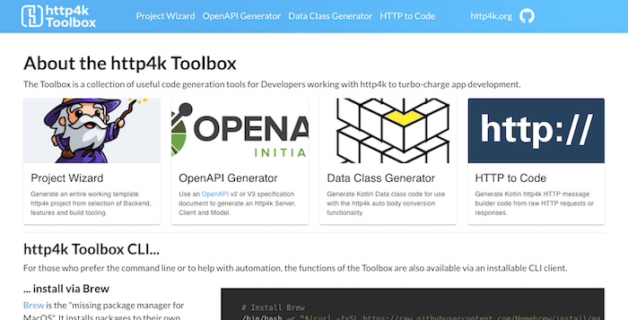

title: http4k blog: http4k v4
description: In preparation for the upcoming release of v4, the http4k team thought we'd do a bit of a retrospective about all the things that have gone in the >260 releases of v3

# http4k v4 unleashed

##### november 2020 / the http4k team

Well, at last it's here - after 3 years - [http4k] v4! Following on from the [retrospective](/blog/retrospective_v3) that we did on version 3, we've been busy polishing, tidying up the edges, and pushing out a bunch of changes to make the project sparkle. Ready? Then let's dive into the good stuff that's been going on at [http4k] Towers.

#### "Four digits good" - the new http4k versioning scheme
Ah yes - versioning - everyone's favourite topic. Part of the reason that [http4k] v3 has been around so long is that we've somewhat been abusing the [Semantic versioning](https://semver.org/) system, something which we've been unhappy with. Here's how it should work:

```text
For Version <A>.<B>.<C>

A = We broke something on purpose. (Breaking API change)
B = Profit. (Feature / Improvement)
C = We broke something by accident. (Bug)
```

Up until now, both breaking and non-breaking API changes on v3 have been done through the second (B) digit of the version - which doesn't allow API users to know if they are expecting a break. At the same time, we wanted to keep major (A) version changes for when there's a big "marketing" release.

To get around this, we are introducing a new versioning scheme based on 4 digits:
```text
For Version <A>.<B>.<C>.<D>

A = There's something we'd like the world to know. (Major change / Marketing)
B = We broke something on purpose. (Breaking API change)
C = Profit. (Feature / Improvement)
D = We broke something by accident. (Bug)
```

As you can see, for our users we'll be concentrating on changes in numbers A (occasional) and C (standard).

#### "Platforms, Guv! Thousands of 'em!" (well, more than a few...)
When [http4k] v3 was released, we only supported 3 JVM Server backends and 1 Serverless platform. Since then, we've added a bunch, and are now up to a very respectable 17 standard deployment options for http4k apps:
```text
10 JVM Backends - Apache 4 & 5, Jetty, Ktor CIO & Netty, Netty, Ratpack, SunHttp and Undertow (+ any Servlet container)
1 Native platform - GraalVM (+ Quarkus)
6 Serverless platforms - Alibaba, AWS Lamba, Azure, Google Cloud, OpenWhisk (IBM/Adobe/Nimbella/Cloudstation), Tencent
```

Switching between all platforms is super easy - just plug the standard `HttpHandler` into the the relevant [http4k] module class with a single line of code. Serverless modules all require just one more line,  plus configuring the Serverless platform to call the relevant function. Here's examples for both:
```kotlin
val app: HttpHandler = { req: Request -> Response(OK).body("hello world!") }

val jvmApp = app.asServer(Netty(8080)).start()

class MyServerlessFunction : GoogleCloudFunction(app)
```

The even better news is that testing your [http4k] apps locally (regardless of platform) is simple - and as ever there's no magic involved - just test them entirely in-memory, or bind them to a standard backend Server.

#### http4k Toolbox

As documented in the [Toolbox announcement post](/blog/guns_for_show), we've been busy consolidating a bunch of handy tools for generating code to work with [http4k] projects, and we christened this the **http4k Toolbox** and it's available in both [online](https://toolbox.httpk.org) and a CLI flavours (available from Brew and SDKMan!). From [Project Generation](https://toolbox.httpk.org/project) to our own more sophisticated [OpenAPI3 Generator](https://toolbox.httpk.org/openapi), we hope that this will be the essential Swiss Army Knife in every **http4k** developer's pocket.



#### New Routing implementation

#### OpenTelemetry: Monitor all the things!

The [OpenTelemetry](https://opentelemetry.io/) project describes itself as...
> **"... a collection of tools, APIs, and SDKs. You use it to instrument, generate, collect, and export telemetry data (metrics, logs, and traces) for analysis in order to understand your software's performance and behavior."


It's a great project run by the CNCF and very well fits in with the ethos that the [http4k] team believes in. As with all [http4k] integration modules, we want to enable [http4k] developers to be able to plug in their apps as simply as possible - in this case, just configure the OpenTelemetry API or Java-agent, then just add some simple `Filters` to your code to start collecting Distributed Traces or Metrics. Several tracing schemes are supported, including Amazon XRay, Jaeger and Zipkin.

For more docs on how to get it all working, head over to the [docs](/guide/modules/opentelemetry).

#### Upgrading & library API changes
Like the neat little worker bunnies we are, we've taken the opportunity to clean up the source code. All previously deprecated code has been removed, leaving the codebase nice and tidy. If you are upgrading, the best idea is to first upgrade to a late v3 version (v3.254.0), deal with the deprecations in place, then simply upgrade again to v4.

#### The http4k website

#### Examples Repo
4. The examples repo continues to grow - there are now examples for deploying http4k apps to *GraalVM* and *Quarkus*, and an 
https://github.com/http4k/examples

#### http4k Connect


5. http4k-connect is our newest project which we hope to eventually standardise patterns for building 3rd party adapters to various backend services, and for building your own Fakes (backed by data-stores such as InMemory and Redis). 

[http4k]: https://http4k.org
[Slack]: http://slack.kotlinlang.org/
