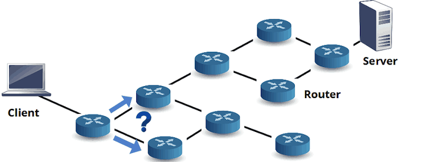
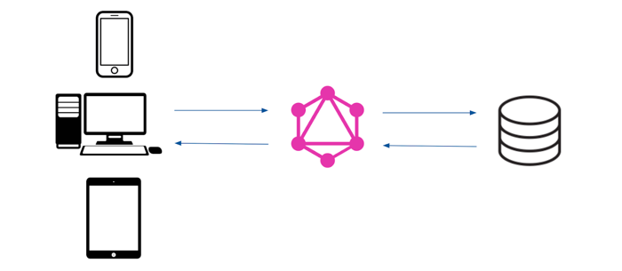

title: http4k blog: http4k v4: 17 platforms and counting...
description: There's a new major http4k release! Read about all the new stuff the team have been working on for http4k v4.

# http4k v4: 17 platforms and counting...

##### january 2021 / the http4k team

Well, at last it's here - after 3 years - http4k v4! Following on from the [retrospective](/blog/retrospective_v3) that we did on version 3, we've been busy polishing, tidying up the edges, and pushing out a bunch of changes to make the project sparkle. Ready? Then let's dive into the good stuff that's been going on at http4k Towers.

<hr/>
#### Four digits good, three digits bad. The new http4k versioning scheme
Ah yes - versioning - everyone's favourite topic. Part of the reason that http4k v3 has been around so long is that we've somewhat been abusing the [Semantic versioning](https://semver.org/) system, something which we've been unhappy with. Here's how it should work:

```text
For Version <A>.<B>.<C>

A = We broke something on purpose. (Breaking API change)
B = Profit. (Feature / Improvement)
C = We broke something by accident. (Bug)
```

Up until now, both breaking and non-breaking API changes on v3 have been done through the second (B) digit of the version - which doesn't allow API users to know if they are expecting a break. At the same time, we wanted to keep major (A) version changes for when there's a big "marketing" release.

To get around this, we are introducing a new versioning scheme based on 4 digits:
```text
For Version <A>.<B>.<C>.<D>

A = There's something we'd like the world to know. (Major change / Marketing)
B = We broke something on purpose. (Breaking API change)
C = Profit. (Feature / Improvement)
D = We broke something by accident. (Bug)
```

As you can see, for our users we'll be concentrating on changes in numbers A (occasional) and C (standard).

<hr/>
#### "Platforms, Guv! Thousands of 'em!" (well, more than a few...)


When http4k v3 was released, we only supported 3 JVM Server backends and 1 Serverless platform. Since then, we've added a bunch, and are now up to a very respectable 17 standard deployment options for http4k apps...

```text
10 JVM Backends - Apache 4 & 5, Jetty, Ktor CIO & Netty, Netty, Ratpack, SunHttp and Undertow (+ any Servlet container)
6 Serverless platforms - Alibaba, AWS Lamba, Azure, Google Cloud, OpenWhisk (IBM/Adobe/Nimbella/Cloudstation), Tencent
1 Native platform - GraalVM (+ Quarkus)
```

Switching between all platforms is super easy - just plug the standard `HttpHandler` into the the relevant http4k module class with a single line of code. Serverless modules all require just one more line, plus configuring the Serverless platform to call the relevant function. Here's examples for both:
```kotlin
val app: HttpHandler = { req: Request -> Response(OK).body("hello world!") }

val jvmApp = app.asServer(Netty(8080)).start()

class MyServerlessFunction : GoogleCloudFunction(app)
```

The even better news is that testing your http4k apps locally (regardless of platform) is simple - and as ever there's no magic involved - just test them entirely in-memory, or bind them to a standard backend Server.

<hr/>
#### http4k Toolbox: your new Swiss Army Knife


As documented in the [Toolbox announcement post](/blog/toolbox), we've been busy consolidating a bunch of handy tools for generating code to work with http4k projects, and we christened this the **http4k Toolbox** and it's available in both [online](https://toolbox.http4k.org) and a CLI flavours (available from Brew and SDKMan!). From [Project Generation](https://toolbox.http4k.org/project) to our own more sophisticated [OpenAPI3 Generator](https://toolbox.http4k.org/openapi), we hope that this become an essential tool in every **http4k** developer's pocket.

<hr/>
#### Infinirouting



The v3 routing scheme was pretty good as you could bind routes on static or dynamic paths and HTTP verbs, but being rampant power seekers, we wanted it to be better. We reasoned that if we could route traffic to HttpHandlers based on those things, then why not be able to route on *any* part of the request? We'd like to be able to do complicated matching - so for instance: 

> **"Match the `/name` path, but only when the `host` header is `http4k.org`. Then add 2 submatches, one where there is a query parameter named `queryName`, the other where the body is > 50 bytes long."**

```kotlin
val app = routes("/{name}" bind POST to (
    header("host") { it == "http4k.org" } bind routes(
        queries("queryName") bind { Response(OK).body("i had a query") },
        body { body: String -> body.length > 50 } bind { Response(OK).body("I was long") }
    ))
)
```

So after a lot of clattering and banging of heads, we cracked it - and in doing so managed to rewrite the entire of the http4k routing layer in terms of these predicate `Routers`. It's really neat, infinitely(ish) nestable, and makes us feel just a little bit smug for getting it working.

<hr/>
#### Graph power


Traditionally, http4k has concentrated on providing routing for REST-style APIs. However, there is this new thing called GraphQL that has suddenly sprung up overnight and seems quite popular. 

Not wanting our users to miss out on anything, we've added support for simply integrating http4k with the official Java implementation of the library, [GraphQL-Java](https://www.graphql-java.com/). This module allows you to both serve and consume GQL APIs, and as per tradition allows you to test your APIs entirely in-memory making for super-fast test suites.

<hr/>
#### OpenTelemetry: Monitor all the things!


The [OpenTelemetry](https://opentelemetry.io/) project describes itself as...
> **"... a collection of tools, APIs, and SDKs. You use it to instrument, generate, collect, and export telemetry data (metrics, logs, and traces) for analysis in order to understand your software's performance and behavior." - OpenTelemetry.io**

It's a great project run by the CNCF and very well fits in with the ethos that the http4k team believes in. As with all http4k integration modules, we want to enable http4k developers to be able to plug in their apps as simply as possible - in this case, just configure the OpenTelemetry API or Java-agent, then just add some simple `Filters` to your code to start collecting Distributed Traces or Metrics. Several tracing schemes are supported, including Amazon XRay, Jaeger and Zipkin.

For more docs on how to get it all working, head over to the [docs](/guide/reference/opentelemetry).

<hr/>
#### Upgrading & library API changes
Like the neat little worker bunnies we are, we've also taken the opportunity to clean up the http4k source code. All previously deprecated code has been removed, leaving the codebase nice and tidy. If you are upgrading, the best idea is to first upgrade to the last v3 version (v3.285.2), deal with any existing deprecations in place, then simply upgrade again to v4.25.7.0.

<hr/>
#### http4k.org
One of the things that our users feedback about was that the structure of the docs in [http4k.org](https://http4k.org) could be improved, so we've begun overhauling the site to simplify the content. Expect this to be a continual improvement thing, but on the whole the content will be organised as follows:

- **Concepts** will contain descriptions of the underlying concepts in and around the http4k libraries.
- **Tutorials** will be step-by-step guides to getting up and running for various use-cases.
- **How-tos** will contain extended examples of how to accomplish particular tasks. eg. provide a custom `ServerConfig` implementation. Code here will generally be complete and contain runnable examples.
- **Module Reference** will contain descriptions of the various features in the different http4k modules. Code in the guide will be snippet-based.
- Additionally, the [Examples repo](https://github.com/http4k/examples) hosts fully self-contained, runnable projects that can be used as a baseline for particular features - eg. how to write and run an [app on Quarkus](https://github.com/http4k/examples/tree/master/quarkus) or use the cloudnative module to enable [typesafe configuration](https://github.com/http4k/examples/tree/master/typesafe-configuration)

<hr/>
#### Support & training

There has been a decent amount of interest lately from our users to come to us to ask for advice about how we can help teams get the best out of http4k. In that vein, we have also been busy building training materials which we can deliver to teams either new to (or experienced in) the library, or to visit teams (currently virtually) to help them out. 

If your team would also like to take advantage of our experience in delivering projects using http4k, then please visit the [support/training](/support) page, reach out and we'd love to see how we can help.

<hr/>
#### http4k Connect - Flyweight 3rd party adapters


[http4k-connect](http://github.com/http4k/http4k-connect) is the team's newest side project, the purpose of which is to eventually standardise patterns for building 3rd party system adapters to various backend services, and for building your own Fakes (backed by data-stores such as InMemory, S3 or Redis). So far (v2.8.0.0), http4k-connect supports at least the common-use case actions for the following systems (and the API is easily extendable for non-supplied actions):

- AWS KMS: Key Management Service
- AWS Lambda
- AWS S3: Simple Storage Service
- AWS Secrets Manager
- AWS SQS: Simple Queue Service
- AWS SSM: Systems Manager
- AWS STS: Security Token Service
- Google Analytics

Mostly, the existence of the project is has been driven by 2 factors:

- to reduce dependency weight of bringing in SDK modules, especially when in a Serverless context. The AWS service SDKs are especially heavy for dependency weight. Using http4k-connect instead of official SDKs, overall Serverless Function distribution size should be reduced by at least an order of magnitude.
- to avoid us having to reinvent the same things again and again! (Because we're very very lazy developers!)

It's pretty hot off the press, but will be receiving a lot of attention over the coming weeks and months, and we'll be documenting the mechanisms in both web and live talks.

<hr/>
#### That's all folks... (for the moment)

We're pretty excited about this release and hope the library will continue to provide powerful tools to make all of our existing (and new!) users' lives easier in creating kick ass and rock solid HTTP applications.

In the meantime, if you are using http4k, please consider [sponsoring the project](https://github.com/sponsors/http4k) to help offset the costs of development, documentation, and support. 

If you're using it commercially, we offer [Commercial Support and Consulting](https://www.http4k.org/support/#commercial_support_consulting) to ensure you're getting maximum value from the toolkit and its related techniques.

As ever, we'd love to hear how we're doing, so please drop into the comm channels to get in touch.

Peace out.

### // the http4k team

[http4k]: https://http4k.org
