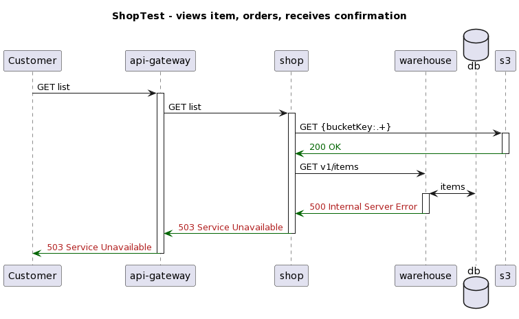
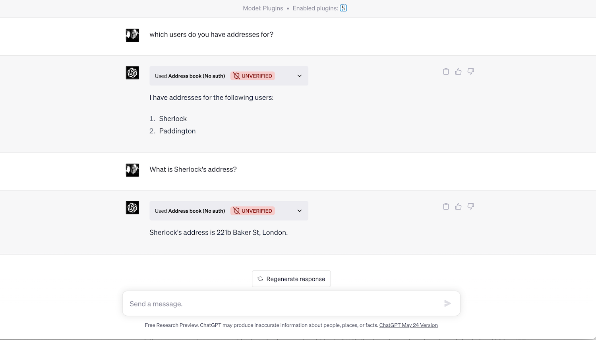

title: http4k blog: http4k v5: New Servers, Loom, TracerBullet, OpenAI plugin SDK and more
description:  There's a new major http4k release! Read about all the new things the team have been working on for http4k v5.

# http4k v5: New Servers, Loom, TracerBullet, OpenAI plugin SDK and more

##### june 2023 / the http4k team

We’re thrilled to announce the next major release of http4k! Since the last major release, the team has been busy enhancing existing features and adding new capabilities from the amazing community, things that we've needed on our own real world projects, and a sprinkling of new magic to keep pushing the boundaries of what's possible with the http4k technology - all 127 modules of it.

The first thing to tell you is that we've hit a significant milestone and are now getting about 1 million downloads per month from Maven Central. From these numbers and our interactions with the global http4k community, it makes the us very happy that so many teams are seeing the power of the Server-as-a-Function model.

## Introducing the http4k Platform v5: 127 modules and counting

Before we dive into the details of the library updates themselves, we're announcing today that for the simplicity (to both the http4k community and the team!), we are unifying all http4k ecosystem projects under a single major platform version number - starting with v5. 

In addition, to keep pace with Java's own rapidly evolving ecosystem, we're going to be switching to aligning major releases of "the Platform"  with every JDK release - currently scheduled for every 6 months. This will allow us to track major-version support as features are added and removed from Java and provide an easy way for our users to track the this compatibility. For the moment, http4k and http4k Connect will still have different release cadence and individual release numbers and which are now developed using Java 20 as a base.

In terms of Java compatibility - for the foreseeable future, we are still going to compile http4k for older Java versions (we still target Java 8 as a base). Over time though, we plan to adjust our standard of support for ancient versions and introduce a paid support program for those who still need to run http4k against legacy versions of Java and require updates such as security patches. If that’s already the case for your team or project, be sure to [get in touch with the http4k team](mailto:contact@http4k.org?subject=Support for legacy JVM version) to discuss your particular needs.

Now - 127 is a pretty big number of modules, especially for what started out with a modest [43 line spike]. But we're definitely not done yet - http4k is a solid foundation - it's arguably one of the simplest and most test-driven web libraries on the planet. We've also proven in http4k-connect that those parts can be composed into an powerful integration layer. Now the http4k team intend to continue that journey - and v5 is just the start.

## http4k

In v4, we shipped a massive 197 releases (an average of 1.5 per week!) and introduced 12 new modules in a variety of areas: deployment ([serverless-lambda-runtime]), wire formats (moshi-yaml, jackson-csv), security ([digest]), testing ([strikt]), and around simpler usages of OpenAPI (Redoc/SwaggerUI). http4k 5 introduces 5 new modules and tidies up the decks for future developments.

### Loom support

We’re excited to see the re-introduction of virtual threads in Java and the performance improvements that can bring to well-established servers. Loom goes gold in Java 21 and we're going to be ready for our users to use it straight away.

For this new major version, we’re introducing three new server backends taking advantage of Java Loom virtual threads: the SDK built-in SunHttp, [Jetty], and [Helidon Nima].

Servers are only half of the story though - http4k will also add support for Loom-friendy HTTP clients as they get released, and is introducing support for the Loom-native Helidon client in this release. We'll be sure to keep up-to-date with the other major HTTP client libraries as they update to support Loom.

### TracerBullet: a brand new way of getting test feedback and documenting your systems

We're incredibly proud to be introducing [TracerBullet], an innovative testing add-on that integrates with the http4k events system. TracerBullet enables teams to focus on **how** their services work, not just **if** they work. This powerful tool will change how you approach testing and help you gain deeper insights into your services.

As a side-effect of introducing TracerBullet, http4k can [automatically generate sequence and interaction diagrams], taking advantage of existing tools such as [PlantUML], [Mermaid], and [d2] to create living documentation for your services after each test run!

The http4k team were excited to be invited back to [KotlinConf 2023], where we presented how we used the TracerBullet along with Hexagonal Design to visually document multi-service tests. You can check out the video of the presentation [here] or see a full example of how it works in the [demo repo].

### Removal of deprecated and unsupported features

As part of the major release cycle, we’re removing all code marked as deprecated in v4 of http4k.

We're also removed the http4k-templates-dust module due to the removal of Nashorn from the Java distribution. We understand this may impact some users, and we recommend seeking alternative solutions in the long term, but you can continue to use the existing `http4k-template-dust` assets which are still binary compatible  with v5 of http4k.

### Upgrading from http4k v4
If you are upgrading, the best idea is to first upgrade to the last v4 version, deal with any existing deprecations in place, then simply upgrade again to v5.0.0.0 and repeat.

## http4k-connect

[http4k-connect] was conceived as a library of providing client adapters for popular cloud services based on the innovative [Connect pattern]. v3 of the library added 20 different modules, and covered a number of popular AWS services, as well as integrating with Kafka via HTTP.

The power of http4k-connect is it's ability to leverage Kotlin to provide modular adapters based around a common core. Each client endpoint is modeled as a separate "Action"? Is the action you want not supported by the core library, or do you want less information to be parsed?  Simple - just write your own endpoint adapter and plug it in!

Today with the v5 release, we're expanding the focus slightly - http4k-connect will now be the home of all official http4k platform integrations with third party services, to cover:

- Featherweight, zero-reflection adapters, for HTTP integrations with cloud services (eg. AWS, Confluent)
- Fake implementations of cloud services, which allow lightning-fast in-memory testing or local testing without Docker/LocalStack.
- A pluggable unified Storage interface with five different storage backends - including in-memory, Redis and S3, as well as a StorageExplorer that provides an OpenAPI UI to allow interaction with the storage via browser.
- Plugin SDKs for building integrations with popular platforms - starting with...

### OpenAI/ChatGPT support

It's 2023, and the new hotness that everyone is talking about is AI - and who are we to go against the weight of the hypemachine? After playing with GPT-4, one of the most frustrating things we found was the slowness of the responses and the effect that had on our testing-cycle, so the http4k team started to build a client adapter and fake OpenAI server so that Kotlin developer teams could integrate and test with OpenAI APIs quickly without waiting ages for the model to respond, and burning through those precious GPT-4 tokens and API limits. And thus [http4k-connect-openai] was born. The Fake server even allows you to generate images.

A little later, the team received an early access invite to the [ChatGPT plugin programme] and it immediately occured that the requirements for developing plugins were all already supported within existing http4k libraries. So we set out to develop a plugin SDK, and [http4k-connect-openai-plugin] was born.

The SDK provides a simple API for developers to simply compose their plugins by supplying come config and a standard `http4k-contract` endpoints, which generate the required OpenAPI specifications. The SDK does the rest for you, providing the required OpenAI plugin manifest, and then protects the API with one of 4 security models - including the ability to "login with ChatGPT" and OAuth into your plugin.

Once created, plugins can be installed into the `FakeOpenAI` server, and expose a standard http4k `HttpHandler` which means they can be tested in memory, run locally standalone, or composed into part of a larger http4k application. It's pretty neat and we can't wait to see what the community uses it for!

There's a full example of how to build a plugin with the http4k-connect-openai-plugin SDK and deploy it to AWS Lambda with Pulumi - see [the repo] for details.

### Removal of deprecated and unsupported features

As part of the major release cycle, we’re removing all code marked as deprecated in v3 of http4k-connect.

### Upgrading from http4k-connect v3
If you are upgrading, the best idea is to first upgrade to the last v3 version, deal with any existing deprecations in place, then simply upgrade again to v5.0.0.0 and repeat.

And that's it (for now!). We hope you're as excited about these updates to the http4k platform as we are! This release brings a wealth of new features and improvements, and we believe it will make your experience using http4k technologies even better.

Cheers,

#### // the http4k team

[http4k]: https://http4k.org
[43 line spike]: https://bit.ly/BarelyMagical
[http4k-connect]: https://github.com/http4k/http4k-connect
[serverless-lambda-runtime]: /guide/tutorials/going_native_with_graal_on_aws_lambda
[digest]: /guide/reference/digest
[strikt]: /guide/reference/strikt/
[Helidon Nima]: https://helidon.io/nima
[Jetty]: https://github.com/eclipse/jetty.project/issues/8007
[TracerBullet]: /guide/reference/tracerbullet/
[PlantUML]: https://plantuml.com/
[Mermaid]: https://mermaid.live/
[d2]: https://d2lang.com/
[KotlinConf 2023]: https://kotlinconf.com/
[automatically generate sequence and interaction diagrams]: /guide/howto/self_document_systems_with_tests
[here]: https://bit.ly/hyperpyramid-kotlinconf
[Connect pattern]: https://dentondav.id/posts/2021/02/smash-your-adapter-monolith
[http4k-connect-openai]: https://github.com/http4k/http4k-connect/tree/master/openai
[the repo]: https://github.com/http4k/http4k-connect-examples/tree/master/developing-openai-plugins
[ChatGPT plugin programme]: https://openai.com/blog/chatgpt-plugins
[http4k-connect-openai-plugin]: https://mvnrepository.com/artifact/org.http4k/http4k-connect-openai-plugin
[demo repo]: https://github.com/http4k/exploring-the-testing-hyperpyramid

