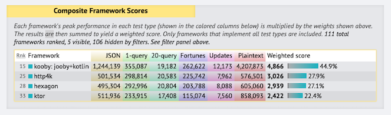
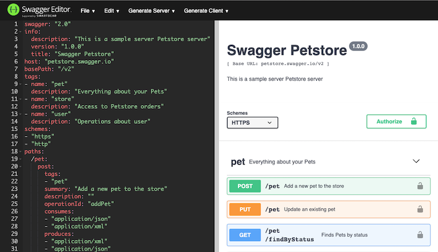
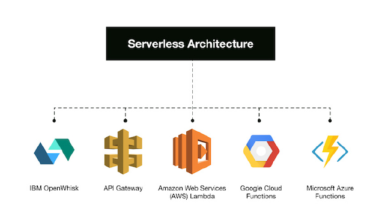

title: http4k blog: A retrospective on http4k v3
description: In preparation for the upcoming release of v4, the http4k team thought we'd do a bit of a retrospective about all the things that have gone in the >260 releases of v3.

# A retrospective on http4k v3

##### september 2020 / the http4k team

It's been quite a long time since we released version 3 of http4k all the way back in November 2017. Wow - that's over 1000 days in fact! Still, that doesn't mean that we've been sitting on our hands over in **http4k Towers** - far from it, we've been busier than ever making sure that we'll remember 2020 for more than just hibernating away in a bunker. In fact, the current interesting situation did give us an idea for a pretty original piece of swag... 


The eagle-eyed amongst you may have noticed that the project branding has undergone a bit of cosmetic surgery - we thought we'd treat ourselves to a professional job as opposed to the one we knocked up on the cheap way back at the start of the project. We're planning to do an entire refit of the content over the next few months, hopefully to make everything a little easier to find and to provide a few more pointers about where to start with the library. Stay tuned...

Anyway, I digress. We thought that we'd do a bit of a retrospective on our version 3 journey. But first off, here are some numbers about what has gone on in those 1000 days in the http4k codebase:

```bash
over 2500 commits!
268 releases
257 PRs merged
139 issues fixed
71 new amazing contributors
28 new http4k library modules
5 newly supported HTTP client libraries
5 new server engines
4 new messaging format modules
4 new testing integrations
2 new serverless backends 
2 new templating libraries supported
0 new dependencies added to the core module 😉
```

If you'd like to check out the old version in the GitHub time machine, [here][v3] is how the code looked all that time ago.

<hr/>
#### Community involvement

One of the most important things to us when we were developing was to create a library that we loved using, and we're thrilled that our users are so positive about http4k as well. The community around the library is just the type that we envisaged - a friendly, helpful and collaborative space, and some of the very best code (be it new modules or and fixes) have come directly from there.
 
 
  
 Our favourite piece of feedback was this post to our Slack channel:

> **"I find the entire http4k project quite exemplary in both function and style/form. At first glance (long time ago) my impression was that it must be deficient because the code-base was too small and the style - simple and elegant -- to the point I was skeptical it would actually work in 'the real world'. I have verified to my satisfaction that I was totally wrong. The apparent simplicity is actually elegance -- a direct representative of the overall design architecture. So thank you -- not just for a great library but also an inspiration and example of excellent engineering we could all strive to follow as a model of something done well." - David A. Lee**

This post made us very happy and all of our efforts feel completely worthwhile. We hope you all feel the same. 😊

As for community reach, we've been in touch with http4k users from all corners of the planet from all kinds of different projects and industries - from COVID tracking apps (relevant!) to Academic Publishers (that one was us) to Investment and Challenger Banks (also us), to No-code platforms. If Twitter is to be believed, the library seems pretty popular in Japan, but no-one on the core team speaks Japanese so we don't actually know why!

<hr/>
#### Globe-trotting

In 2018, we were lucky enough to be invited to [KotlinConf] in Amsterdam to talk about the development of [http4k], and this led to us presenting at a total of 10 international conferences, meetups and privately hosted company events spanning across 5 timezones to talk about the library and it's development story. As (apparent) ambassadors for how successful Kotlin can be in the serverside arena, so watch this space in the latter part of 2020 and beyond...

<div style="padding-top: 20px">
<iframe width="560" height="315" src="https://www.youtube.com/embed/vdxBNh1qx1Q" frameborder="0" allow="accelerometer; autoplay; encrypted-media; gyroscope; picture-in-picture" allowfullscreen></iframe></div>

<hr/>
#### On the radar

Another high point for us was having http4k featured in the [Thoughtworks Technology Radar], which is a quarterly publication highlighting tools, techniques and languages that the well-known consultancy have been using to successfully deliver projects across the globe. ThoughtWorks called out the test-driven nature of [http4k], citing:

> **"Apart from its elegance and simplicity, we also like its emphasis on testability — given that the entities in the libraries are immutable and the routes in the app, as well as the app itself, are just functions, they're super easy to test." - TW TechRadar**


As Kotlin cements its reputation as a solid choice for serverside (and eventually everywhere!) development, and continues to receive backing from successful projects across the proprietary and open source ecosystems, we hope to be able to do our bit to nudge it ever further upwards in the ["most loved language"] tables.

<hr/>
#### Performing to a crowd
One of the most frequent questions that we get asked about http4k is "how does it perform?". We attempted to answer that question by entering our baby into the TechEmpower benchmarks, which is a suite of tests which pits each library against the rest of the pack in a set of real-world-esque scenarios to see how it performs including JSON serialisation, database access and HTML templating generation.

<a href="https://www.techempower.com/benchmarks/#section=data-r19&hw=ph&test=composite&l=xan9xb-1r"></a>

Overall, we were thrilled (and continue to be) with the results of the benchmarks. Since the first round (16), http4k has been the best performing pure Kotlin web library across the contenders. The most important factor to us that there were no special tricks involved in the implementations - ie. the endpoints under test were written exactly as they would be on a "real" project and no custom tuning other than standard JVM options applied.

In terms of the performance of the server backends, Apache HttpComponents (version 4) has been consistently the strongest performer in the previous benchmarks, although there have been performance improvements to the Netty backend implementations that we are hopeful in the upcoming round 20 might make it a real contender for the http4k 👑.

<hr/>
#### Enter the platform!

When we conceived [http4k], it was a simple 40 line shim over the top of another Java-based framework, bashed together on a HackDay. Never did we realise that a few years later it would be a very popular library with over 40 modules! For this reason (and to save on typing), we introduced the `http4k-bom` module (learn more about BOM [here][BOM], allowing users to use a single version of all http4k libraries and then just import the modules they need.

```groovy
dependencies {
    implementation platform("org.http4k:http4k-bom:3.259.0")
    implementation "org.http4k:http4k-core"
    implementation "org.http4k:http4k-server-undertow"
}
```

<hr/>
#### Cloudy-wowdy stuff

Just as in every codebase there is a package called "utils", this also happens with libraries - useful code that doesn't quite fit anywhere else, yet you just always end up needing. For [http4k], these utils were about the ancillary stuff that goes around an application to make it support 12-factor ideals such as configuration and relative primitives. We didn't want to put this stuff into the `http4k-core` module as we felt it wasn't absolutely necessary (and we wanted to continue to keep the binary size of the core module down). Thus, `http4k-cloudnative` was born! The major feature of this module is loading typesafe Environmental configuration of applications, using - what else...


Yep - the reusing of the existing http4k lens system to cover configuring your apps, meaning that it's now impossible to make easy mistakes such as setting a 10-second timeout as 10-milliseconds! You can check out exactly how to use the feature [in the docs][cloudnative].

<hr/>
#### Testing modules

It's no secret that the http4k team love testing - it's part of our core DNA and the simplicity of core design would be worthless unless we could test apps built with the library simply and effectively. To that end, some of the most exciting additions that we've added to the library have been in the arena of testing:

* [Approval Testing] is a technique for simplifying complex assertions that might otherwise be more effectively checked by eye. `http4k-testing-approval` provides the primitives and tooling for supporting this style of testing,
* [Chaos Testing] was made famous by Netflix for proving out how systems react when everything heads south. `http4k-testing-chaos` adds transparent, programmable failure-generation to any http4k app using only a simple `Filter`.
* [Service Virtualization] enables API test contracts to be encoded and then shipped, simplifying the process of proving that apps retain compatibility, `http4k-testing-servirtium` provides the basis for recording and replaying contracts from disk or from other sources such as GitHub.


<hr/>
#### OpenAPI FTW

One of the most popular and standout http4k features is the support for the OpenApi specification. Originally supporting Swagger 2 spec via the `http4k-contract` module, we rewrote the implementation to add support for much more complete (and consistent!) version 3 of specification in May 2019. The module will now generate fully compliant OpenAPI3 documentation, including full JSON Schema breakdowns for class models and taking advantage of Kotlin class features such as enums and nullability. Powered by the http4k lens API, this runtime system allows developers to avoid concerning themselves with tediously documenting API models which can easily go stale.



<hr/>

#### Serverless turnabout

The major http4k feature in version 3.0.0 was the addition of support for Serverless backends - namely the granddaddy of Serverless - AWS Lambda. And you know what they say about the first implementation of something? They say that it's probably wrong. Well, turns out they were right (again). When we got to introducing the second and third implementations of Serverless (Google Cloud Functions and OpenWhisk), we realised that the approach taken for AWS wasn't very dev friendly... it relied on reflection to solve the problem of loading the Lambda function class. This actually broke one of our own cardinal rules that we set for the http4k project: 

> **"Absolutely no magic involved: No reflection. No annotations." - 5th Commandment of http4k**
 
So - we did what any good dev team would do and replaced the magic function loading mechanism with a more developer friendly API working by class extension. Fear not readers - the guilty parties have been appropriately punished, and it (probably) won't happen again. 😉



One other piece of interesting research which came out and somewhat vindicated the dependency-lite approach of http4k was [Cold Start War], which performed a lot of experiments and concluded that:

> **"As expected, the dependencies slow the loading down. You should keep your Functions lean, otherwise, you will pay in seconds for every cold start." - Mikhail Shilkov**

For production deployments, we continue to recommend the use of a tool such as Proguard or R8 to massively reduce the size of packaged Serverless Function JAR file. The http4k serverless modules also ship with zero or minimal dependencies to avoid any transitive bloat that might occur.

<hr/>

#### Going native

Apart from Serverless, one of the most exciting things happening in JVM-land right now is the advent of native technologies such as Quarkus and GraalVM, giving the possibility of compiling apps direct to binaries - which give a massive performance boost. It's a young technology and often involves various amounts of trickery to get around limitations of the native system regarding areas such as reflection. Luckily for us (and you!), http4k operates on an anti-magic principle (see the 5th commandment above) and it was a nice surprise when it occurred that, with the correct server engine (Apache for the curious), http4k applications can be packaged out-of-the-box to this format with absolutely no modifications of aforementioned trickery. 


We look forward to further supporting these technologies as they develop, and will endeavour to provide custom modules to suppport teams who want to take advantage of them.

<hr/>

#### Future echoes...

> **“And the open road rolled out in front of us.” - Alexandra Bracken, In The Afterlight**

So what's next? Well, we've got a load of good stuff coming up for post version 4 of [http4k], the rest of 2020 and beyond. As well as the website improvements, we've got a bunch of tools in the works to make the library more quick-start friendly, including the ability to autogenerate advanced http4k Clients and Server stubs from OpenApi specifications - both from the command-line and from the browser. We're also looking at improvements in the versioning scheme to better communicate breaking changes, and rolling out modules to enable better Serverless platform support. 

Whatever happens though, the focus of http4k will always be on providing a best-in-class Developer and Testing experience. We'd love to hear how we're doing, so please drop into the comm channels to get in touch. Here's to the future. Stay safe out there and we'll see you in it.


### // the http4k team

[github]: http://github.com/daviddenton
[http4k]: https://http4k.org
[Slack]: http://slack.kotlinlang.org/
[Thoughtworks Technology Radar]: https://www.thoughtworks.com/radar/languages-and-frameworks/http4k
[Cold Start War]: https://mikhail.io/2018/08/serverless-cold-start-war/
[v3]: https://github.com/http4k/http4k/tree/6639c964abf43c265591e3f70eb59467e60cd089
[cloudnative]: https://http4k.org/guide/modules/cloud_native/
[KotlinConf]: https://bit.ly/serverasafunction
["most loved language"]: https://insights.stackoverflow.com/survey/2020#technology-most-loved-dreaded-and-wanted-languages-loved
[Approval Testing]: http://approvaltests.com
[Chaos Testing]: http://principlesofchaos.org
[Service Virtualization]: https://servirtium.dev
[BOM]: https://medium.com/java-user-group-malta/maven-s-bill-of-materials-bom-b430ede60599
