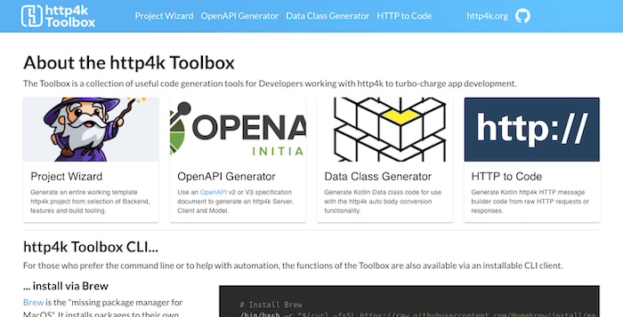
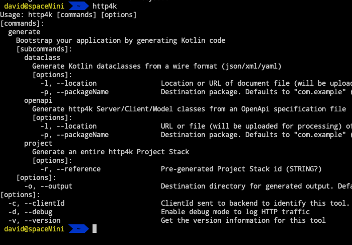

title: http4k blog: http4k Toolbox: Guns for show, knives for a pro
description: An introduction to the http4k Toolbox website and CLI, and how we developed them.

# http4k Toolbox: Guns for show, knives for a pro

##### november 2018 / [@daviddenton][github]


Over the years of creating apps with [http4k], we've collated several tools that we use to turbo charge our development activities. With the advent of v4 of the library, and with a little time on our hands, we decided to bring all of these tools together into a single place so that all of our users could get their benefits. 

These tools are mostly based around code generation of some sort or another and are mainly used to shortcut repetitive or mundane development tasks that you might encounter when developing and testing applications with [http4k]. For development, we made extensive use of the excellent [http4k] web library (have you heard of it? it's really rather good!), as well as [KotlinPoet](https://square.github.io/kotlinpoet/) and [Bunting4k](https://github.com/fork-handles/forkhandles/tree/trunk/bunting4k), a new CLI flags library that we created for this task.

A lot of the credit for the creation of the Toolbox has to go to the amazing [Albert Latacz](https://github.com/albertlatacz), who not only created large parts of the functionality, but also investigated build and deployment options.

<hr/>
#### Web toolbox


An obvious place to start was the web, so we created a React UI using the amazing [Material-UI](https://material.io/) components library and are deploying it to [Heroku](https://www.heroku.com/) with [GitHub Actions](https://github.com/features/actions). The main concept behind each of the functions is to allow the user to preview any generated code before they download it. We have also set up automated pipelines to update the Toolbox whenever we do a release of [http4k]. It's worth noting that the Toolbox is also entirely stateless, so no user content is recorded in any form.

The http4k Toolbox is available @ [toolbox.http4k.org][Toolbox]

<hr/>
#### CLI


The http4k team are massive fans of automation, so we also wanted to enable teams to use the functions of the [Toolbox] in a shell. Hence, we decided to also make a CLI agent for the Toolbox. It is available via [Brew](https://brew.sh) and [SDKMan](https://sdkman.io). You can find instructions about how to install it on the [Toolbox homepage](https://toolbox.http4k.org). 

<hr/>
### Toolbox functionality guide
Where we introduce each of the functions of the [Toolbox], with a rationale and a bit of background on each:

<hr/>
##### Generating a project


This is quite a common one for various libraries, but they tend to be quite basic - and we thought we could do better. 

The http4k [Project Generator](https://toolbox.http4k.org/project) is an intelligent questionnaire-based wizard which allows the user to select their backend, extra modules, and build system. It then crunches all of the code from these choices together into a coherent project configuration (called a "Stack"), and provides a reusable link for regenerating the same project configuration again. 

The questionnaire is dynamically generated by providing options for all of the 17+ supported Server and Serverless backends, and the further 30+ [http4k] integration modules, including examples of the different types of tests that you can write for apps. We can also add other "features" to be mixed in to the project structure. 

As well as downloading the project, you can also browse the generated code in a browser.

Try ou the project generator [here](https://toolbox.http4k.org/project).

<hr/>
##### OpenAPI3 Server, Client, & Models


[http4k] already supports generating OpenAPI3 specification documents from your code, but one thing that you often come across is when you need to generate an HTTP server or Client for someone else's application which is documented with using the same format. Initially we did look at the existing OpenAPI generator projects available, but they are mostly based around static templates, and once again we thought we could do something a little more sophisticated.

The [OpenAPI generator](https://toolbox.http4k.org/openapi). accepts a JSON or YAML specification (or URL), and generates:

- **Data Classes for JSON API model schemas** - The message objects are generated using a "best guess" algorithm from the JSON Schema information in the specification document, mapping the base JSON types to their Kotlin equivalents.
- **Template http4k Server implementation** containing a set of generated API endpoint functions and Lens implementations for all defined HTTP contract parts (path, query etc), as well as auto-marshalled JSON request and response bodies. Security implementations (API Key, Basic, Bearer) are also generated.
- **http4k API client implementation** with functions generated for each API endpoint. Lens implementations are generated and HTTP contract parts (path, query etc) are marshalled both into and out of the Request and Response messages.

As well as downloading z ZIP, you can also browse the generated code in a browser.

The OpenAPI generator is available [here](https://toolbox.http4k.org/openapi).

<hr/>
##### Generating Data Classes for wire formats
Most of the time when working with API models in [http4k], you have example messages in the native format which need to be auto-marshalled into Kotlin using Jackson or one of the other supported format libraries. This results in a very boring exercise in conversion, so we wrote this [converter](https://toolbox.http4k.org/dataclass) that will generate Data Classes to support reading/writing of JSON, XML and YAML messages. For example, this JSON...

```json
{
    "jsonRoot": {
        "child": [
            "hello",
            "there"
        ],
        "num": 123
    }
}
```

... results in these Data Classes:

```kotlin
data class JsonRoot(val child: List<String>?, val num: Number?)

data class Base(val jsonRoot: JsonRoot?)
```

Convert your JSON/XML/Yaml [here](https://toolbox.http4k.org/dataclass).

<hr/>
##### HTTP -> HTTP message builder
Occasionally you have the raw version of an HTTP message and want to create an identical [http4k] HTTP message object from it. This [tool](https://toolbox.http4k.org/http) converts a raw message to the syntax. For example: 

```text
POST /example/index.html?query1=abc&query2=def HTTP/1.1
Host: toolbox.http4k.org
Accept: image/gif, image/jpeg, */*
Content-Type: text/plain

hello from http4k
```

... results in this HTTP message builder code:

```kotlin
fun request(): Request = Request(Method.POST, "/example/index.html")
	.query("query1", "abc")
	.query("query2", "def")
	.header("Host", "toolbox.http4k.org")
	.header("Accept", "image/gif, image/jpeg, */*")
	.header("Content-Type", "text/plain")
	.body("""hello from http4k""")
```

Build HTTP messages from raw HTTP [here](https://toolbox.http4k.org/http).

<hr/>
#### Wrapping up
We hope you'll find the various tools that we've built into the [Toolbox] useful to either get started with [http4k] or to make your life even more productive. As ever, let us know how we're doing, and if there are any other tools that you think might be helpful then we'd love to hear about them!

### // the http4k team

[github]: http://github.com/daviddenton
[http4k]: https://http4k.org
[Toolbox]: https://toolbox.http4k.org
