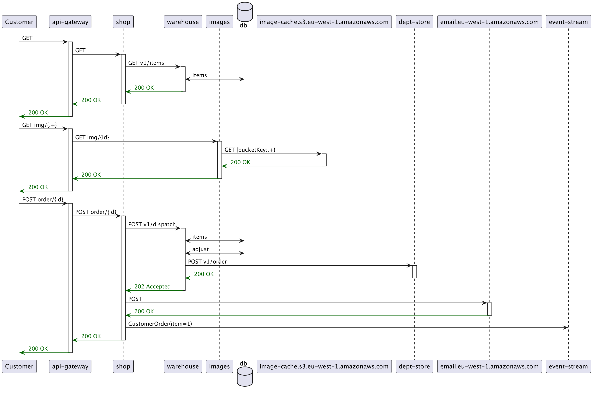
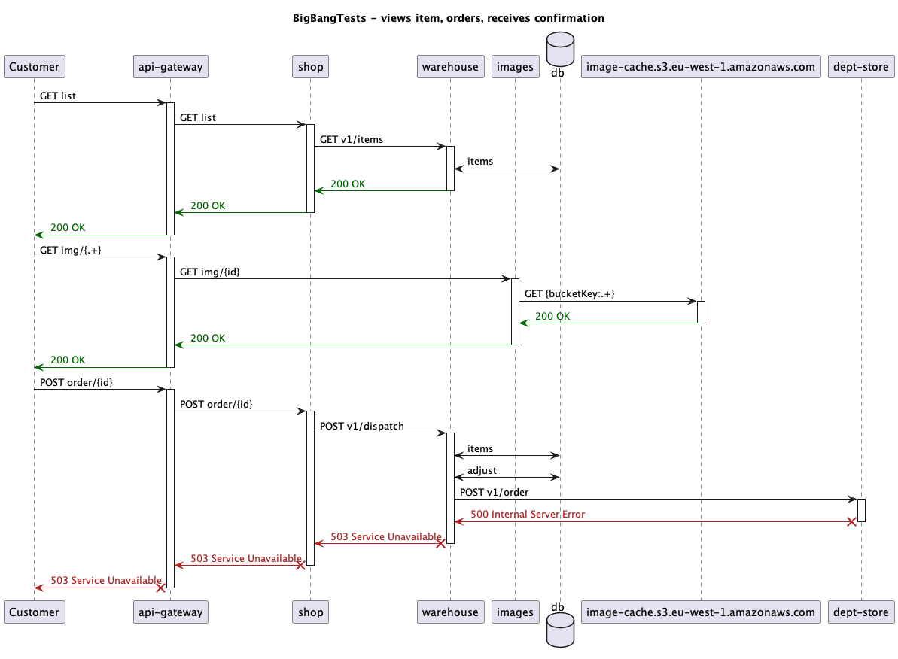

title: http4k TracerBullet Module
description: Feature overview of the http4k-tracerbullet module

### Installation (Gradle)

### Gradle setup

```kotlin
dependencies {
    implementation(platform("org.http4k:http4k-bom:4.41.4.0"))
    implementation("org.http4k:http4k-testing-tracerbullet")
}
```

The http4k TracerBullet module brings together a lot of http4k innovations to help you to self-document your system and
let's you answer questions about your system with your tests apart from the obvious one - "Does it work?".

The essential idea is that the application uses the `Events`  interface to send interesting information to a collector
during the running of tests through a JUnit extension. At the end of the test run, the `TracerBullet` collates these
Events using a distributed tracing mechanism (X-B3 headers) and a set of `Tracers` to create a tree of what exactly
happened during the test - these events can be anything, but good examples are:

1. HTTP traffic in and out of the application
2. Database calls
3. Business events

Once we have the "Trace tree", we can use it to extract information about our applications and then use `Renderers` to
use it to document HOW our system behaves as well as if it works. Examples of these renders are:

1. PUML/Mermaid Sequence or Interaction diagrams
2. Analysis of the number of outbound calls that a particular application is making.
3. Eliminating duplicate database calls or inefficient logic.
4. When testing multiple apps together using the Server-as-a-Function/Hexagonal techniques, we can also see the entire
   timeline of every call, so we can also determine maximum hop distance.

And here is an example of a multi-service test and the type of visual documentation that is created:



Additionally, in the case of the test failing, the extension still auto-generates the trace diagram for the traffic 
which did occur - this provides excellent feedback as to where the system went wrong:



One of the best things about the TracerBullet plugin is that it fits in seamlessly with the rest of the http4k stack.
Once your applications have been designed to send data to the Events stream, just install the plugin and the diagramming
comes for free!

#### Code [](https://github.com/http4k/http4k/blob/master/src/docs/guide/howto/self_document_systems_with_tests/example.kt)

Here's an example of making this work - note the use of the filters to use RequestTracing on the Events and the servers
and clients. This is required to make the TracerBullet work.

<script src="https://gist-it.appspot.com/https://github.com/http4k/http4k/blob/master/src/docs/guide/howto/self_document_systems_with_tests/example.kt"></script>

An extended example of this technique can be found at the [this repository](https://github.com/http4k/exploring-the-testing-hyperpyramid).

[http4k]: https://http4k.org
