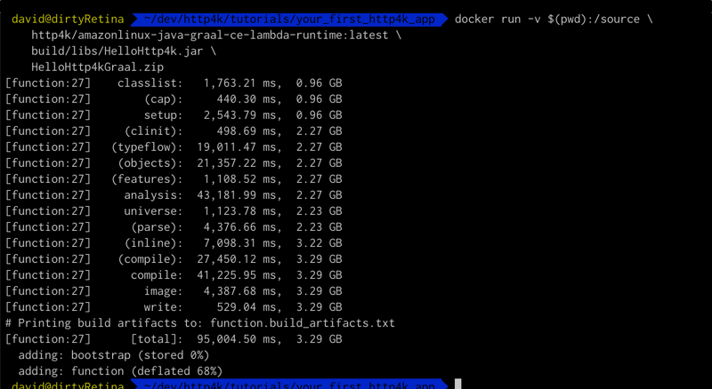
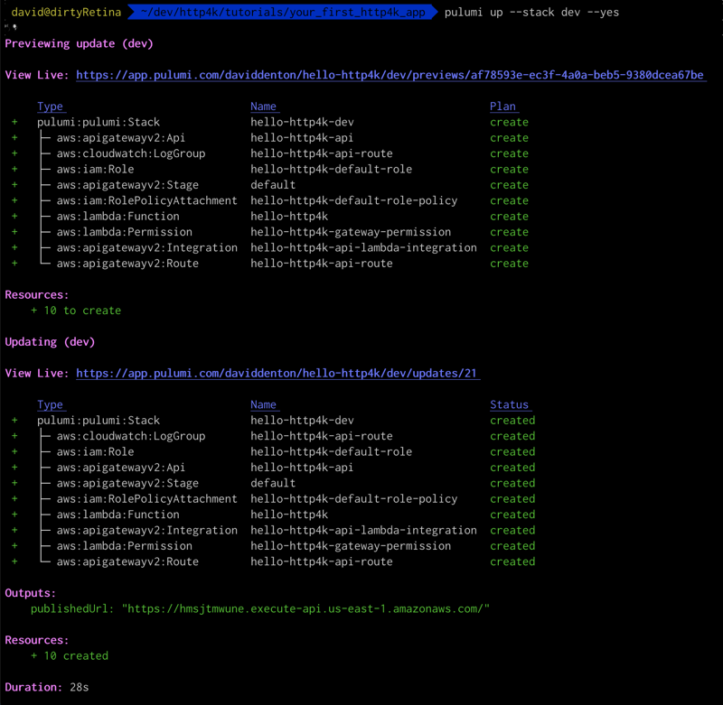
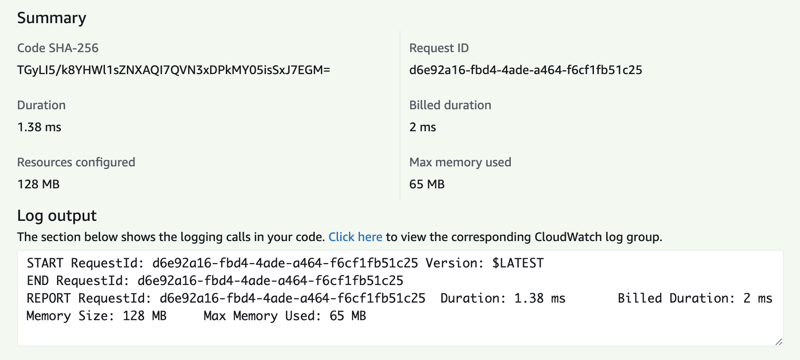

title: http4k Tutorial: Going native with Graal on AWS Lambda
description: A step-by-step guide to compiling http4k apps with GraalVM for AWS Lambda

In this guide, we'll run you through the steps required to get an http4k application deployed and running on AWS Lambda with GraalVM and available to call over the internet using AWS ApiGateway. If you're not familiar with the http4k concepts for HTTP and Serverless apps, then we advise you read them [here](/guide/concepts/http/) and [here](/guide/concepts/serverless/). To make an app you can follow the [Your first http4k app] tutorial. Then follow the steps in the [Serverless http4k with AWS Lambda] tutorial before tackling this guide.

We'll take an existing http4k application built with Gradle and deployed with Pulumi, add the bits that are important to GraalVM Serverless HTTP apps, then compile it natively and deploy it to AWS Lambda and API Gateway using Pulumi. The resulting Lambda has super-quick startup time and low memory footprint.

## Pre-requisites:
- All the pre-requisites from the [Your first http4k app] and [Serverless http4k with AWS Lambda] tutorials. This will give you a working http4k application deployed to AWS Lambda.
- Docker installed and running on your system. See [here]() for details.
<hr/>

#### Step 1
We need to add the AWS Lambda Serverless Runtime module to our project. Install it into your `build.gradle` file with:

```groovy
implementation("org.http4k:http4k-serverless-lambda-runtime:4.13.4.0")
```

This custom runtime is a lightweight, zero-reflection module which allows you to deploy both Java and GraalVN based binaries to AWS.

#### Step 2
Lambdas working from a native binary have to supply their own `main` function to launch the runtime, instead of implementing the standard `Request/StreamHandler` interfaces. To use it on our app, we simply create a launcher and wrap our http4k `HttpHandler` with the appropriate FnHandler class before starting the Runtime:

<script src="https://gist-it.appspot.com/https://github.com/http4k/http4k/blob/master/src/docs/guide/tutorials/going_native_with_graal_on_aws_lambda/HelloServerlessHttp4k.kt"></script>

#### Step 3
Compile the Lambda code into a GraalVM file is a 2 stage process. First, install and configure the ShadowJar plugin into `build.gradle` to merge the entire application into a single JAR file with a known main class. Add the following sections:
```groovy
buildScript {
    dependencies {
        classpath 'com.github.jengelman.gradle.plugins:shadow:6.1.0'
    }
}

apply plugin: 'com.github.johnrengelman.shadow'

shadowJar {
    manifest.attributes['Main-Class'] = 'guide.tutorials.going_native_with_graal_on_aws_lambda.HelloServerlessHttp4kKt'
    archiveBaseName.set(project.name)
    archiveClassifier.set(null)
    archiveVersion.set(null)
    mergeServiceFiles()
}
```
Run the new task with:

```shell
./gradlew shadowJar
``` 

... and then take a note of the JAR file that appears in `build/libs`.

#### Step 4
Now that we have our JAR file, we need to create a GraalVM image and package it into a ZIP file which can be uploaded to AWS. http4k supplies a convenience Docker image that uses the `native-image` program to create the binary and then packages the ZIP file:
```shell
docker run -v $(pwd):/source \
    http4k/amazonlinux-java-graal-ce-lambda-runtime:latest \
    build/libs/HelloHttp4k.jar \
    HelloHttp4kGraal.zip
```

GraalVM will churn away for a few minutes and all being well, the `HelloHttp4kGraal.zip` file will be generated in the main directory. 



#### Step 5
We need to update our Pulumi configuration to upload the new binary. This is pretty simple and just involves changing the runtime, ZIP target and handler in our `index.ts`. We can also remove the `timeout` as the native binary will startup in milliseconds:

```typescript
const lambdaFunction = new aws.lambda.Function("hello-http4k", {
    code: new pulumi.asset.FileArchive("HelloHttp4k.zip"),
    handler: "unused",
    role: defaultRole.arn,
    runtime: "provided.al2"
});
```

#### Step 6
Deploy your ZIP file to AWS with:
```shell
pulumi up --stack dev --yes
```
Pulumi will churn for a bit and all being well will display the URL at the end of the process.



#### Step 7
You can now call your deployed lambda by visiting: `https://{publishedUrl}/echo/helloHttp4k`. You should see `helloHttp4k` in the response body. Notice that the response time is super-super quick, especially after the lambda is warm. If we invoke it from the console, you should see something similar:



#### Step 8
To avoid any unwanted AWS charges, don't forget to delete all of the resources in your stack when you've finished by running:
```shell
pulumi destroy --stack dev --yes
```

#### Congratulations!
You have successfully compiled an http4k application with GraalVM, then deployed and invoked it as a Lambda in AWS!

[Your first http4k app]: /guide/tutorials/your_first_http4k_app
[Serverless http4k with AWS Lambda]: /guide/tutorials/serverless_http4k_with_aws_lambda
[pulumi]: https://www.pulumi.com/docs/get-started/install/
