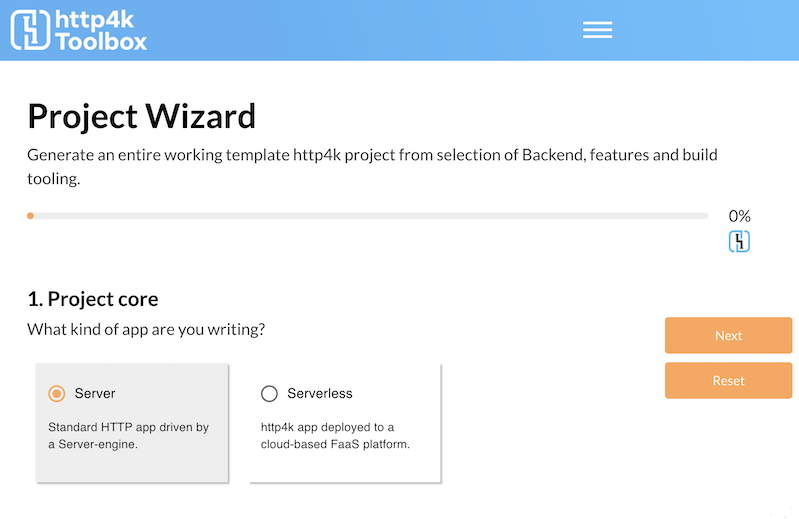
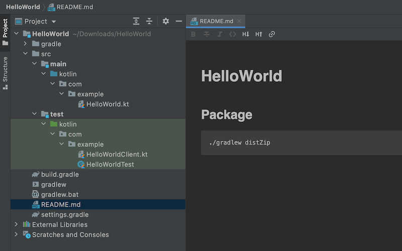
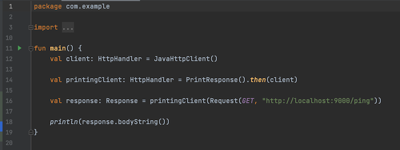
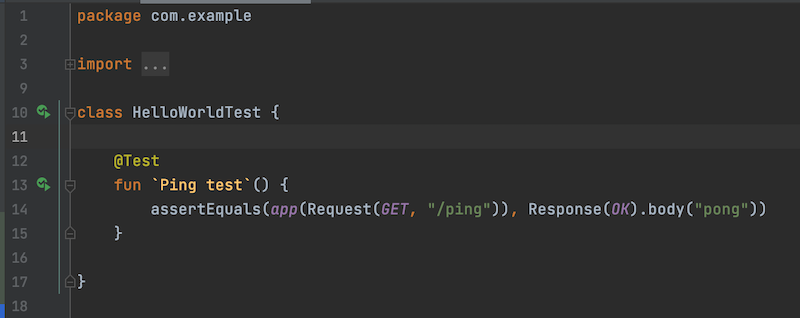

title: http4k Tutorial: Your first http4k app
description: A step-by-step guide creating your first running http4k app

Welcome to the world of http4k! In this guide, we'll run you through the steps required to get up and running with your first Kotlin server application. We'll generate the project, make some requests to it and then build it into a runnable application. By the end, you'll have a fully working app built packaged and tested using the Gradle build tool.

## Pre-requisites:
- An internet connection
- JDK 11 or greater installed and set up
- An IDE/Text-editor - (http4k is developed using IntelliJ)

#### Step 1
First, we'll generate and download a project template from the http4k Toolbox. Point your browser at [toolbox.http4k.org](https://toolbox.http4k.org) and select the **Project Wizard** from the menu.

The Toolbox is designed as a questionnaire which will help you configure a working project from all of the available http4k modules. There are several stages, but for this guide we're just going to generate the project using the defaults. 

We explain each of the parts in the remainder of this step, but if you just want to skip to the end, just keep hitting **Next** until the progress bar hits 100% then go to **step 2**:

a. First we select a deployment model for our App - **Server** or **Serverless**. Hit **Next** to select **Server**.

b. We don't need any realtime components such as Websockets. Hit **Next**.

c. The third page allows us to select whichever Server backend we want. The default option is **SunHttp** which is pre-bundled with the core module. Hit **Next**.

d. Next, we can choose an HTTP client. The **Java HTTP** Client is also pre-bundled. Hit **Next**.

e. **Parts 2 and 3** allows us to select bolt-on functionality and testing modules. Keep hitting **Next** until you get to **Part 4**.

e. Now we can name the main class and package of our application. If you're happy with the defaults (later steps will assume you are), hit **Next** twice.

f. Finally, we can choose a build tool and packaging for the app. We'll use the defaults of Gradle with ZIP distribution.

#### Step 2
Once you're finished, the Toolbox will review your choices and you can hit **Download**. Unzip and import the project into your IDE. In Intellij, you choose: `File -> New -> Project from existing sources`. and select the `build.gradle` file inside the unpacked ZIP.

#### Step 3
The project is fully formed and buildable, it consists of:

a. Build files and scripts for gradle

b. A runnable program containing the http4k app in the `src/main/kotlin` directory

c. The `src/test/kotlin` directory containing a working test and a runnable client program for our app.

#### Step 4
First, let's take a tour of the `/src/main/kotlin/HelloWorld.kt` file which contains our production app.

- **Lines 14-18** defines our production application. It consists of a single HTTP endpoint binding all HTTP `GET` requests on the path `/ping` to an `HttpHandler` function. This   function takes an implicit `Request` parameter `it` (which it ignores), and just constructs and returns a `Response` object with status and a static body string. The return type of the call to `routes()` is also an `HttpHandler`.
- **Lines 20-26** form a runnable program which starts our application.
- **Lines 21** decorates our app with a `Request` printing `Filter`. This returns another `HttpHandler`. 
- **Lines 23**  binds the app onto an instance of the `SunHttp` Server backend and starts it on port `9000`.

Hit the little green arrow and the application will run and start. Point your browser at `http://localhost:9000/ping` to check that it's working. Note that the `Filter` is printing each incoming request to the console.

#### Step 5
In `/src/main/kotlin/HelloWorldClient.kt` there is an example of an HTTP client which we can use to call our running app.

- **Lines 12** creates an HTTP client - note that it's type is also `HttpHandler`.
- **Lines 14** decorates the client with a `Response` printing `Filter`. The result type of new client is also `HttpHandler`.
- **Lines 16** constructs an HTTP `Request` and calls the client app with it, receiving a response.

Try running the client by hitting the little green arrow on **line 11**. You'll see the `Response` printed to the console by the `Filter`, followed by a repeat of the body content, which is printed by **line 18**.

#### Step 6
Modify the request in `/src/main/kotlin/HelloWorldClient.kt` to point at `http://localhost:9000/pong` instead. Run the client program again and note that a 404 is printed. This happens because we have not bound an `HttpHandler` to that endpoint.

#### Step 7
A test for our app is found in `/src/main/kotlin/HelloWorldTest.kt`. Run it with the green arrow on **line 10** and it should pass.

Cool things to notice about the test:

1. As our `app` is just an `HttpHandler` function, it runs entirely in-memory. It is therefore super-fast and completely threadsafe.
2. There is no custom core or other setup required for the test to run.
3. `Request` and `Response` objects are immutable data classes, and can therefore be compared safely in tests.

#### Step 8
Let's package our app into a runnable Application. From the IDE or command line, run `./gradlew distZip`. This will create an standard application ZIP file with scripts to run the app and deposit it in the `build/distributions` directory.

#### Congratulations!
You have successfully:

1. Created an working http4k project using the http4k Toolbox. 
2. Bound a simple `HttpHandler` function to particular HTTP endpoint.
3. Seen how the http4k `HttpHandler` and `Filter` model provide a simple set of composable building blocks to construct HTTP applications.  
4. Tested the application entirely in-meory with no custom libraries or code.
5. Packaged your http4k app into a ZIP file.

[comment]: <> (Ready for more? Let's move on to [the second stage]&#40;./the_second_stage&#41;,)
